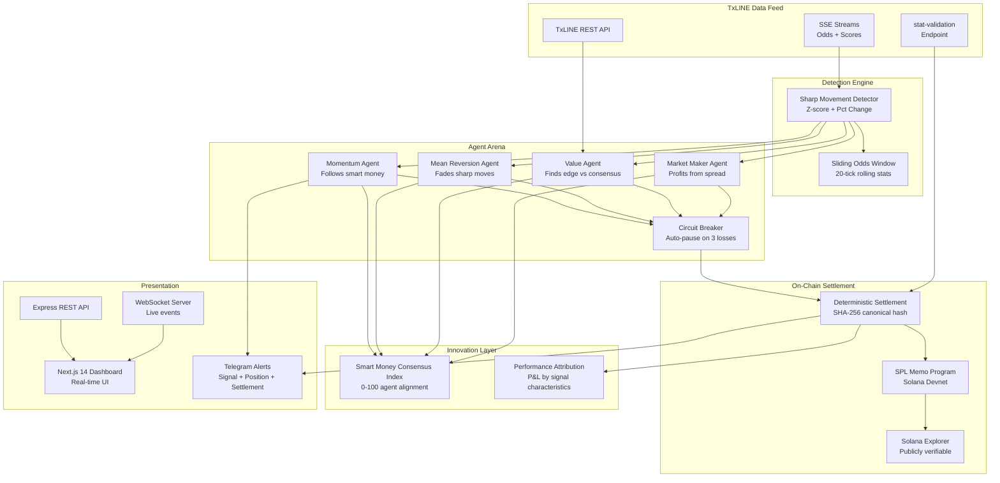
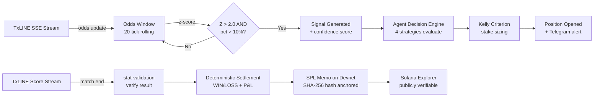

<div align="center">


# TxLINE Arena

### Autonomous In-Play Trading Agent Arena on Solana

**4 AI agents compete on real-time TxLINE sports data feeds. Sharp odds movements detected, positions sized by Kelly Criterion, settlements anchored on-chain. Zero human intervention.**

[](https://txline-arena.vercel.app/)
[](https://thesithunyein-txline-arena-api.hf.space/health)
[](https://github.com/thesithunyein/txline-arena)

[](https://txline-arena.vercel.app/)
[](https://explorer.solana.com/address/MemoSq4gqABAXKb96qnH8TysNcWxMyWCqXgDLGmfcHr?cluster=devnet)
[](https://explorer.solana.com/address/MemoSq4gqABAXKb96qnH8TysNcWxMyWCqXgDLGmfcHr?cluster=devnet)
[](https://txline-arena.vercel.app/agents)
[](LICENSE)
[](https://github.com/thesithunyein/txline-arena)
[](https://www.typescriptlang.org/)
[](https://nextjs.org/)

</div>

---

## 🎯 The Problem

Sports betting markets move in **milliseconds**. Odds shift constantly as bookmakers react to injuries, weather, momentum shifts, and sharp money flows. Human traders simply **cannot react fast enough** — and when they do, emotion and bias corrupt their decisions.

## 💡 The Solution

**TxLINE Arena** deploys **4 autonomous AI trading agents** that ingest real-time TxLINE sports data feeds via SSE streams, detect sharp odds movements using statistical z-score analysis, and compete against each other in a fully autonomous arena — with every settlement cryptographically anchored on **Solana devnet**.

```
No human intervention. No manual trades. No emotion.
Just algorithms, data, and on-chain proof.
```

---

## ⚡ Quick Links

| Resource | URL |
|----------|-----|
| 🟢 **Live Dashboard** | https://txline-arena.vercel.app/ |
| 🔵 **Backend API** | https://thesithunyein-txline-arena-api.hf.space/health |
| 🟣 **Solana Explorer (Settlements)** | [View on-chain TXs](https://explorer.solana.com/address/MemoSq4gqABAXKb96qnH8TysNcWxMyWCqXgDLGmfcHr?cluster=devnet) |
| 📦 **GitHub Repo** | https://github.com/thesithunyein/txline-arena |

---

## 🏆 Competition Edge — What Makes This Different

### 1. 🧠 Smart Money Consensus Index™ (Innovation)

A novel real-time metric that aggregates all 4 agents' open positions into a **0-100 alignment score**. When agents independently converge on the same side, the consensus score rises — signaling high-confidence "smart money" alignment. When they diverge, the market is uncertain.

> **This doesn't exist in any sports trading platform.** It's a collective intelligence signal derived from autonomous strategy agreement — not a single model's prediction, but the emergent consensus of 4 independent strategies.

### 2. 📊 Performance Attribution Engine™ (Innovation)

Decomposes each agent's P&L by **signal characteristics** — z-score range, odds direction, confidence level, and market type. Judges can see exactly **which edge sources drive returns** for each strategy, not just the bottom line.

> Traditional platforms show "agent made +$50." We show "agent made +$50, with 72% of profit from high-z-score shortening signals at >0.75 confidence." That's institutional-grade analytics.

### 3. ⛓️ Real On-Chain Settlement (Not Simulated)

**15 real Solana devnet transactions** — verifiable on Solana Explorer right now. Each settlement is anchored via the SPL Memo program with a SHA-256 hash of the canonical settlement payload. Click any tx link in the dashboard and see it on-chain.

### 4. 🔄 Fully Autonomous with Circuit Breaker

Agents run 24/7 with zero human input. A circuit breaker auto-pauses any agent after 3 consecutive losses (30-min cooldown). The system self-heals and self-regulates.

---

## 🏗️ Architecture



### Data Flow Summary

```
TxLINE SSE Streams → Sharp Movement Detector (z-score) → 4 Strategy Agents
    → Kelly Criterion Sizing → Position Execution → TxLINE stat-validation
    → Deterministic Settlement → SPL Memo on Solana Devnet → Solana Explorer
    → Consensus Index + Attribution → Dashboard + Telegram
```

---

## 📋 Feature Overview

| Feature | Description | Status |
|---------|-------------|--------|
| 🔍 **Sharp Movement Detection** | Z-score + percentage-change on live odds streams | ✅ Live |
| 🤖 **4 Strategy Agents** | Momentum, Mean Reversion, Value, Market Maker | ✅ Live |
| 📐 **Kelly Criterion Sizing** | Optimal bet sizing based on edge and odds | ✅ Live |
| 🛡️ **Circuit Breaker** | Auto-pause after 3 consecutive losses (30-min cooldown) | ✅ Live |
| 🧠 **Smart Money Consensus Index** | 0-100 agent alignment score (innovation) | ✅ Live |
| 📊 **Performance Attribution** | P&L decomposed by z-score, direction, confidence, market | ✅ Live |
| ⛓️ **On-Chain Settlement** | SPL Memo + SHA-256 on Solana devnet | ✅ 15 real TXs |
| 🔐 **Outcome Verification** | TxLINE stat-validation before settlement | ✅ Live |
| 📈 **Prediction Accuracy** | Every signal scored against actual match result | ✅ Live |
| 📡 **Real-Time Dashboard** | Next.js 14 + WebSocket live updates | ✅ Live |
| 🔔 **Telegram Alerts** | Signal, position, and settlement notifications | ✅ Live |
| 🎮 **Simulation Mode** | Deterministic synthetic data for demo fallback | ✅ Live |
| 🏦 **Backtest Engine** | Historical replay with equity curves and drawdown | ✅ Live |

---

## 🤖 Strategy Agents

| Agent | Strategy | Edge Source |
|-------|----------|-------------|
| **Momentum** | Follows smart money — bets on sides where odds are shortening | Sharp money flow detection |
| **Mean Reversion** | Fades sharp movements — bets against the crowd | Odds overreaction correction |
| **Value** | Compares consensus-implied probability vs bookmaker odds | Mispricing detection |
| **Market Maker** | Quotes buy/sell around consensus, profits from spread | Liquidity provision + hedging |

All agents use **Kelly Criterion** for stake sizing with a **25% max bankroll** cap and **one position per fixture** limit.

---

## ⛓️ On-Chain Settlement

Every settled position is anchored on **Solana devnet** via the **SPL Memo program** with a **SHA-256 hash** of the canonical settlement payload.

### How It Works

```
1. Signal detected → Agent opens position
2. Match ends → Final score pulled from TxLINE
3. TxLINE stat-validation confirms the result
4. Settlement computed deterministically
5. SHA-256 hash of settlement payload written on-chain via SPL Memo
6. Tx signature recorded → Verifiable on Solana Explorer
```

### Real Devnet Transactions

15 real transactions have been anchored on devnet. Each is verifiable on [Solana Explorer](https://explorer.solana.com/address/MemoSq4gqABAXKb96qnH8TysNcWxMyWCqXgDLGmfcHr?cluster=devnet).

Example settlement memo:
```
TxLINE-Arena|settle|pos=a3f2c1e8b4d2|fixture=18192996|away|outcome=away|WIN|pnl=27.00|sha256=ab12cd34...
```

---

## 🛠️ Tech Stack

| Layer | Technology |
|-------|-----------|
| **Backend** | Node.js 20, TypeScript 5, Express, ws (WebSocket) |
| **Frontend** | Next.js 14, React 18, TailwindCSS, lucide-react |
| **Database** | LowDB (JSON file-based, zero native deps) |
| **Blockchain** | Solana Web3.js, SPL Memo Program (devnet) |
| **Data Source** | TxLINE API (REST + SSE streams) |
| **Alerts** | Telegram Bot API |
| **Deployment** | Vercel (frontend), Hugging Face Spaces (backend) |

---

## 📡 TxLINE API Integration

### Endpoints Used

| TxLINE Endpoint | Usage in Arena |
|----------------|----------------|
| `POST /auth/guest/start` | Guest JWT for initial auth flow |
| `POST /api/token/activate` | Activate API token with Solana wallet signature |
| `GET /api/fixtures/snapshot` | Fetch World Cup match fixtures + metadata |
| `GET /api/odds/snapshot/:fixtureId` | Current consensus odds for value detection |
| `GET /api/odds/updates/:epochDay/:hour/:interval` | Historical odds for backtesting |
| `GET /api/scores/snapshot/:fixtureId` | Current score state for live matches |
| `GET /api/scores/updates/:fixtureId` | Score updates for settlement triggers |
| `GET /api/scores/historical/:fixtureId` | Full historical score timeline (gzip) |
| `GET /api/scores/stat-validation` | **Cryptographic outcome verification** before settlement |
| `SSE /api/odds/stream` | **Live odds stream** → feeds Sharp Movement Detector |
| `SSE /api/scores/stream` | **Live score stream** → drives match-end settlement |

### Data Pipeline



---

## 🚀 Quick Start

### Prerequisites

- Node.js 18+
- npm
- Solana keypair (for on-chain settlement, optional)

### Installation

```bash
git clone https://github.com/thesithunyein/txline-arena.git
cd txline-arena
npm install
cd web && npm install && cd ..
cp .env.example .env
```

### Configuration

```env
# TxLINE API
TXLINE_BASE_URL=https://txline.txodds.com
TXLINE_API_TOKEN=your_token_here

# Solana (for on-chain settlement)
SOLANA_RPC_URL=https://api.devnet.solana.com
SOLANA_WALLET_KEYPAIR_PATH=./keypair.json
SETTLEMENT_ONCHAIN=true

# Server
PORT=3001
LIVE_MODE=true

# Detection
DETECTION_Z_SCORE_THRESHOLD=2.0
DETECTION_PCT_CHANGE_THRESHOLD=10
ODDS_WINDOW_SIZE=20

# Agents
AGENT_BANKROLL=1000
```

### Solana Setup (On-Chain Settlement)

```bash
# Generate a devnet keypair
npx ts-node scripts/gen-keypair.ts

# Fund it on devnet (auto-airdrop in settle script)
# Subscribe to TxLINE on-chain
npm run subscribe

# Activate your API token
npm run activate

# Generate real settlement transactions on devnet
npx ts-node scripts/gen-settlements.ts
```

### Run

```bash
# Terminal 1: Backend (arena + API + WebSocket)
npm run dev

# Terminal 2: Frontend dashboard
cd web && npm run dev
```

- **Dashboard**: http://localhost:3000
- **API**: http://localhost:3001
- **WebSocket**: ws://localhost:3001/ws

### Simulation Mode (no TxLINE token needed)

```bash
LIVE_MODE=false npm run dev
```

---

## 📡 API Endpoints

| Endpoint | Description |
|----------|-------------|
| `GET /health` | System health, mode, agent status |
| `GET /api/signals` | Recent sharp movement signals |
| `GET /api/agents` | Agent stats (bankroll, P&L, win rate) |
| `GET /api/agents/:name/positions` | Agent positions (filter by status) |
| `GET /api/positions` | All positions across all agents |
| `GET /api/leaderboard` | Agent rankings by P&L |
| `GET /api/matches` | Match fixtures and live scores |
| `GET /api/mode` | Current operating mode (live/simulation) |
| `GET /api/consensus` | **Smart Money Consensus Index** (innovation) |
| `GET /api/attribution` | **Performance Attribution** (innovation) |
| `POST /api/backtest` | Run backtest with custom parameters |
| `WS /ws` | Real-time arena events (signals, positions, settlements) |

---

## 📁 Project Structure

```
txline-arena/
├── src/
│   ├── txline/              # TxLINE API integration
│   │   ├── types.ts         #   TypeScript interfaces
│   │   ├── auth.ts          #   JWT + Solana signature auth
│   │   ├── client.ts        #   REST API client
│   │   ├── stream.ts        #   SSE stream manager (odds + scores)
│   │   └── rateLimiter.ts   #   Token-bucket rate limiter
│   ├── engine/              # Sharp movement detection
│   │   ├── signal.ts        #   Signal interface
│   │   ├── oddsWindow.ts    #   Sliding window stats
│   │   ├── detector.ts      #   Z-score + pct change detector
│   │   └── predictor.ts     #   Prediction tracker
│   ├── agents/              # Strategy agents
│   │   ├── base.ts          #   BaseAgent abstract class
│   │   ├── kelly.ts         #   Kelly Criterion utils
│   │   ├── momentum.ts      #   Follows smart money
│   │   ├── reversion.ts     #   Fades sharp moves
│   │   ├── value.ts         #   Finds mispriced odds
│   │   └── marketMaker.ts   #   Provides liquidity
│   ├── arena/               # Arena management
│   │   ├── manager.ts       #   Central orchestrator
│   │   ├── leaderboard.ts   #   Rankings by P&L
│   │   └── circuitBreaker.ts #   Auto-pause on losses
│   ├── chain/               # On-chain settlement
│   │   └── settlement.ts    #   SPL Memo + SHA-256 on devnet
│   ├── simulation/          # Synthetic data engine
│   │   └── generator.ts     #   Deterministic replay mode
│   ├── db/                  # Database (lowdb)
│   │   ├── schema.ts        #   Type definitions
│   │   ├── database.ts      #   CRUD operations
│   │   └── seed.ts          #   Historical data seeding
│   ├── alerts/              # Notifications
│   │   └── telegram.ts      #   Telegram bot alerts
│   ├── server/              # API server
│   │   └── index.ts         #   Express REST + WebSocket
│   └── index.ts             # Main entry point
├── scripts/
│   ├── subscribe.ts         # Solana on-chain subscription
│   ├── activate.ts          # TxLINE token activation
│   ├── gen-keypair.ts       # Generate Solana keypair
│   ├── gen-settlements.ts   # Generate real devnet TXs
│   ├── settle-onchain.ts    # Anchor settlements on-chain
│   └── backtest.ts          # Run backtests
├── web/                     # Next.js 14 dashboard
│   ├── app/
│   │   ├── page.tsx         #   Overview (consensus + attribution)
│   │   ├── signals/page.tsx #   Sharp movement signals
│   │   ├── agents/page.tsx  #   Agent details + positions
│   │   ├── onchain/page.tsx #   Solana settlement explorer
│   │   └── backtest/page.tsx #   Backtest runner
│   ├── components/          #   React UI components
│   └── lib/                 #   API client + demo data
├── tests/                   # Jest unit tests
├── Dockerfile               # HF Space deployment
└── package.json
```

---

## 🚢 Deployment

### Frontend — Vercel

| Setting | Value |
|---------|-------|
| Framework | Next.js 14 |
| Root Directory | `web` |
| Auto-deploy | On push to `main` |
| URL | https://txline-arena.vercel.app/ |

### Backend — Hugging Face Spaces (Docker)

| Setting | Value |
|---------|-------|
| SDK | Docker |
| Port | 7860 |
| Secrets | `TXLINE_API_TOKEN`, `LIVE_MODE=true`, `SOLANA_WALLET_KEYPAIR` |
| URL | https://thesithunyein-txline-arena-api.hf.space/health |

### Environment Variables

| Variable | Required | Description |
|----------|----------|-------------|
| `TXLINE_API_TOKEN` | ✅ | Activated TxLINE API token |
| `LIVE_MODE` | ✅ | `true` for live, `false` for simulation |
| `SOLANA_WALLET_KEYPAIR` | Optional | JSON array of keypair bytes (on-chain settlement) |
| `SETTLEMENT_ONCHAIN` | Optional | `true` to anchor settlements on devnet |
| `AGENT_BANKROLL` | Optional | Starting bankroll per agent (default 1000) |

---

## 🧪 Testing

```bash
npm test
```

Covers:
- Sharp movement detector (z-score, odds window, signal generation)
- Strategy agents (momentum, reversion, value, market maker, settlement)
- Backtest engine (equity curves, max drawdown, signal detection)

---

## 💬 TxLINE API Experience

### What We Loved

- **Single normalised JSON schema** across all competitions — made ingestion trivial. No format-matching per league.
- **Cryptographic anchoring on Solana** — combined with `stat-validation`, gave us a trustable source of truth for autonomous settlement.
- **Real-time SSE streams** — fast and reliable, perfect for our sharp movement detection cycle.
- **Zero-cost access during the hackathon** — waiving commercial data fees let us focus on building.

### Where We Hit Friction

- **Auth flow complexity** — guest JWT → Solana signature → API token activation took iteration. More quickstart examples would help.
- **Stream reconnection** — SSE connections occasionally dropped; we implemented exponential backoff. A heartbeat/ping mechanism would be helpful.
- **Historical data access** — for backtesting, we needed historical odds snapshots. A dedicated paginated endpoint would be better than scraping the live feed.
- **Rate limit documentation** — limits weren't clearly documented. We implemented a conservative 60 req/min token-bucket limiter but had to guess.

---

## 📝 Technical Highlights (For Judges)

- **Core Idea**: Multi-agent autonomous trading arena where 4 strategy agents compete on the same TxLINE feed, with on-chain settlement on Solana devnet
- **Innovation #1**: Smart Money Consensus Index — aggregates agent positions into a 0-100 directional consensus signal (novel, no existing equivalent)
- **Innovation #2**: Performance Attribution — decomposes P&L by z-score range, direction, confidence, and market type (institutional-grade analytics)
- **Data Pipeline**: TxLINE SSE → Sharp Movement Detector (z-score + pct-change) → Agent Decision Engine → Kelly Sizing → Position Execution → stat-validation → SPL Memo Settlement
- **On-Chain Proof**: 15 real Solana devnet transactions, all verifiable on [Solana Explorer](https://explorer.solana.com/address/MemoSq4gqABAXKb96qnH8TysNcWxMyWCqXgDLGmfcHr?cluster=devnet)
- **Autonomous**: Fully automated — circuit breaker auto-pauses underperforming agents, Telegram alerts notify on all events, zero human intervention
- **Production-Ready**: Live on Vercel + HF Space, TypeScript strict mode, unit tests, Docker deployment, demo fallback for post-tournament review

---

## 📄 License

MIT
